# Converting BMP files into JPEG

_not finished_

## **Understanding the Formats**

**BMP** (Bitmap): BMP is an uncompressed or minimally compressed image format. It stores raw pixel data, meaning each pixel's color information (typically RGB) is directly represented. This results in large file sizes but perfect fidelity to the original image.
**JPEG** (Joint Photographic Experts Group): JPEG is a lossy compression format primarily designed for photographic images. It achieves high compression ratios by discarding some visual information that is less perceptible to the human eye. This makes JPEG files significantly smaller than BMP files, but the compression is irreversible.

## **Overview of the Conversion Process**

The conversion from BMP to JPEG can be broadly summarized by these steps:
- **Read BMP Data**: Extract pixel data and image dimensions.
- **Color Space Conversion**: Transform RGB pixel data to YCbCr.
- **Chroma Subsampling**: Reduce the resolution of color information (Cb, Cr).
- **Discrete Cosine Transform (DCT)**: Convert spatial pixel data into frequency components.
- **Quantization**: Reduce the precision of frequency components, introducing loss.
- **Zig-zag Scan**: Reorder quantized coefficients for efficient compression.
- **Run-Length Encoding (RLE)**: Compress sequences of zeros.
- **Huffman Coding**: Apply variable-length codes for further compression.
- **JPEG File Structure**: Assemble the compressed data with headers and tables.

## **Detailed Conversion Steps**

### **Reading BMP Data** 
   
The first step is to parse the BMP file. This involves: Reading the BMP header to get information like file size, image width, height, and pixel depth. Extracting the raw pixel data, which is typically stored in a BGR (Blue, Green, Red) order for each pixel.

### **Color Space Conversion (RGB to YCbCr)**
   
JPEG compression works more efficiently in the YCbCr color space than in RGB. 
- **Y** (Luminance): Represents the brightness or intensity of the pixel. The human eye is most sensitive to changes in luminance. 
- **Cb** (Chroma Blue): Represents the blue-yellow difference. 
- **Cr** (Chroma Red):S Represents the red-green difference.
Each RGB pixel is converted to a YCbCr triplet using specific mathematical formulas. The Y, Cb, and Cr values are typically shifted so they are centered around 0 (e.g., Y from 0-255, Cb/Cr from -128 to 127 or 0-255 with an offset).

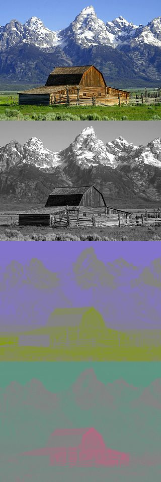

### **Chroma Subsampling**

This is a key step where loss is introduced. The human eye is less sensitive to fine details in color than in brightness. Therefore, JPEG often reduces the resolution of the Cb and Cr components. Common subsampling ratios include:
- **No subsampling**: All components retain full resolution. 
- Cb and Cr are sampled horizontally at half the rate of Y.
- Cb and Cr are sampled both horizontally and vertically at half the rate of Y. This means for every 4 Y pixels, there is only 1 Cb and 1 Cr sample. 

This step significantly reduces the amount of color data to be processed, contributing heavily to compression.

### **Discrete Cosine Transform (DCT)**

After color space conversion and subsampling, each Y, Cb, and Cr component is divided into non-overlapping 8x8 pixel blocks. The DCT is then applied to each of these 8x8 blocks. The DCT transforms the pixel data from the spatial domain (pixel values) to the frequency domain (frequency coefficients).  The top-left coefficient (0,0) is the DC coefficient, representing the average value (or overall intensity) of the 8x8 block.  The remaining 63 coefficients are AC coefficients, representing higher frequency variations (details, textures, edges) within the block.

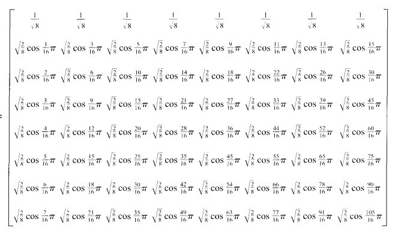

### **Quantization**

This is where the majority of the lossy compression occurs. Each of the 64 frequency coefficients from the DCT is divided by a corresponding value in a quantization table. Quantization tables contain values that are typically higher for high-frequency coefficients, meaning these details are divided by larger numbers and thus lose more precision (become zeros or small integers). The resulting quantized coefficients are integers, many of which become zero, especially for high-frequency components. This step effectively discards less important visual information. The quality setting of a JPEG (e.g., 90% quality) directly influences the values in these quantization tables. Higher quality means smaller quantization values, less loss, and larger file sizes.

### **Zigzag Scan** 

The 64 quantized coefficients in each 8x8 block are rearranged into a one-dimensional sequence using a zigzag pattern. This pattern groups low-frequency coefficients (which tend to have larger values and are more significant) together at the beginning of the sequence, followed by runs of zeros for the high-frequency coefficients. This reordering is crucial for the next compression step.

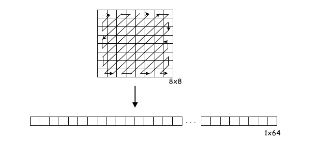

### **Run-Length Encoding (RLE)**

After the zigzag scan, the sequence of coefficients often contains long runs of zeros. RLE is applied to compress these runs. It typically encodes (skip, value) pairs, where "skip" is the number of preceding zeros and "value" is the next non-zero coefficient. An "End of Block" (EOB) marker is used to signify that all remaining coefficients in the block are zero. For the DC coefficients (the first coefficient of each block), a differential encoding is used: the DC coefficient of the current block is encoded as the difference from the DC coefficient of the previous block. This exploits the strong correlation between adjacent block DC values.

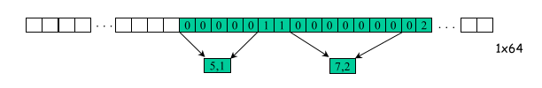

### **Huffman Coding** 
   The final stage of entropy encoding uses Huffman coding. Huffman coding is a variable-length coding scheme where more frequently occurring symbols (e.g., common RLE pairs, DC differences, EOB markers) are assigned shorter bit codes, while less frequent symbols get longer codes. Standard Huffman tables are often used, but custom tables can also be generated based on the image's specific data for potentially better compression. This step is lossless; it only reduces the file size by using more efficient bit representations.

### **JPEG File Structure**

Finally, all the compressed data for Y, Cb, and Cr components, along with necessary metadata, are assembled into a JPEG file. A JPEG file typically includes:
- Markers: Special byte sequences that indicate the start/end of the image, sections, etc. crucial for a decoder to correctly parse the file and understand its structure.
  
  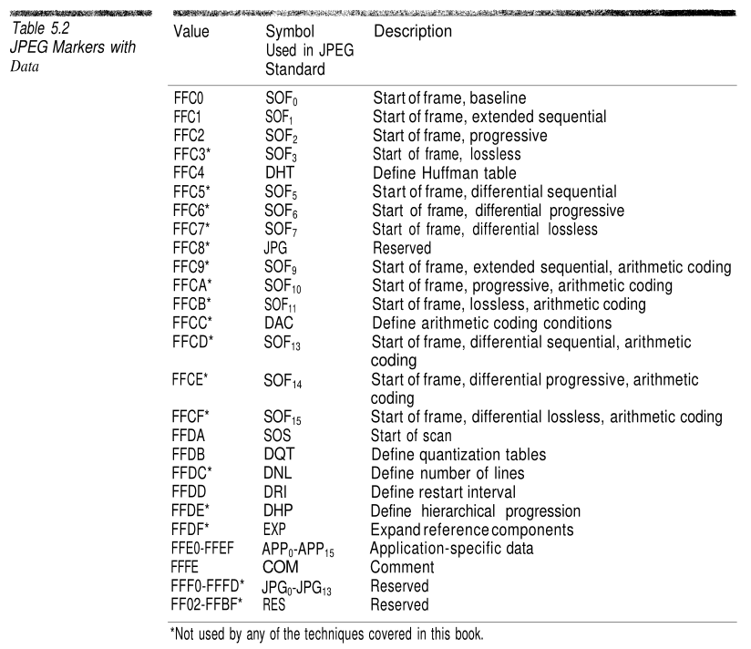
  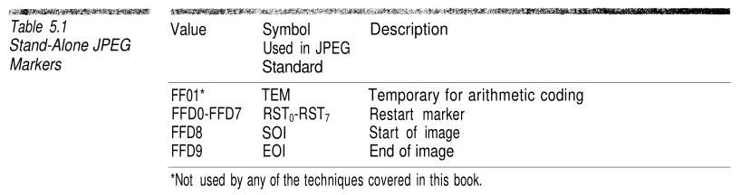

- Quantization Tables (DQT): The tables used during quantization, which dictate the level of detail preserved for different frequency components.
  
  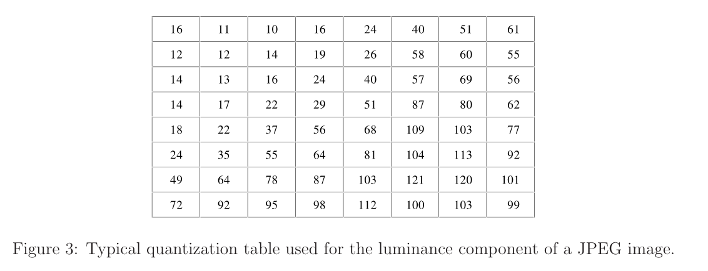

- Huffman Tables (DHT): The tables used for Huffman decoding, essential for decompressing the encoded data back into coefficients.
  
  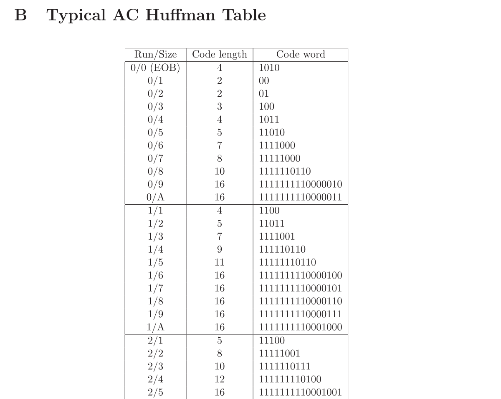

- Frame Header (SOF): Fundamental image properties like dimensions, color components, and precision. 
- Scan Data (SOS): The actual compressed bitstream of Y, Cb, and Cr data.

  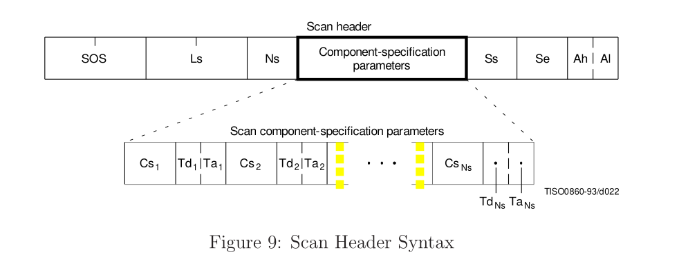
  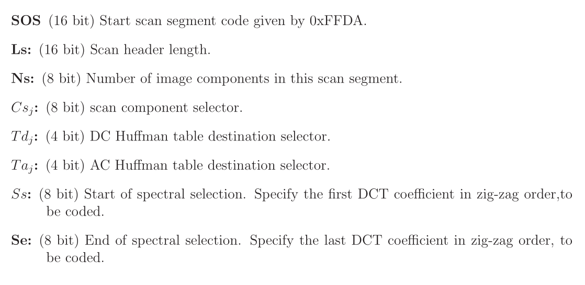
  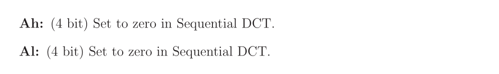

These elements collectively form the complete JPEG file, enabling efficient storage and transmission of images.

## **Key Differences and Why JPEG is Smaller**

The primary reasons JPEG files are significantly smaller than BMP files are:
- Lossy Compression: JPEG discards information, especially in the chroma components and high-frequency details, which is imperceptible to the human eye. BMP retains all information. 
- Color Space Transformation: YCbCr is more amenable to compression techniques. 
- Chroma Subsampling: Reduces the amount of color data by typically 50% or 75%. 
- Frequency Domain Transformation (DCT): Allows for selective discarding of less important frequency information. 
- Quantization: The core lossy step, rounding off-frequency coefficients. 
- Entropy Encoding (RLE & Huffman): Efficiently compresses the remaining data without further loss.

## Conclusion 

The conversion from BMP to JPEG is a sophisticated process that leverages human visual perception to achieve impressive compression ratios. By transforming pixel data into frequency components, quantizing them, and then applying various encoding techniques, JPEG effectively balances image quality with file size, making it ideal for web images and digital photography where storage and bandwidth are concerns.

## Bibliography

1. [BMP GitHub summary](https://gibberlings3.github.io/iesdp/file_formats/ie_formats/bmp.htm#RasterData)
2. [BMP Wiki](https://en.wikipedia.org/wiki/BMP_file_format#Color_table)
3. [BMP Official Windows Documentation](https://learn.microsoft.com/en-us/dotnet/desktop/winforms/advanced/types-of-bitmaps?view=netframeworkdesktop-4.8)
4. [SDL Wiki - for debugging](https://wiki.libsdl.org/SDL2/SDL_PixelFormatEnum)
5. [JPEG Official Documentation](https://jpeg.org/jpeg/)
6. [JPEG Wiki](https://en.wikipedia.org/wiki/JPEG)
7. [*Compressed Image File Formats JPEG, PNG, GIF, XBM, BMP. Your guideline to graphics files on the Web*, John Miano](README_resources/book1.pdf), Addison Wesley, 1999
8. [Branch Education YouTube video](https://www.youtube.com/watch?v=Kv1Hiv3ox8I&list=WL&index=16&ab_channel=BranchEducation)
9. [JFIF File Interchange Format, Version 1.02](https://web.archive.org/web/20120301195630/http:/www.jpeg.org/public/jfif.pdf)
10. [Webpage - quantization table](https://www.sciencedirect.com/topics/computer-science/quantization-table)
11. [Digital Video Processing for engineers, Suhel Dhanani, Michael Parker](README_resources/book2.pdf)
12. [Webpage - jpeg compression](https://cgjennings.ca/articles/jpeg-compression/)
13. [Webpage - jpeg definitive guide](https://www.thewebmaster.com/jpeg-definitive-guide/)
14. [Purdue University JPEG Lab Guide](README_resources/lab.pdf)
15. [INFORMATION TECHNOLOGY – DIGITAL COMPRESSION AND CODING OF CONTINUOUS-TONE STILL IMAGES – REQUIREMENTS AND GUIDELINES, CCIT](README_resources/itu-t81.pdf)
16. [This PPT presentation](README_resources/presentation.pdf)