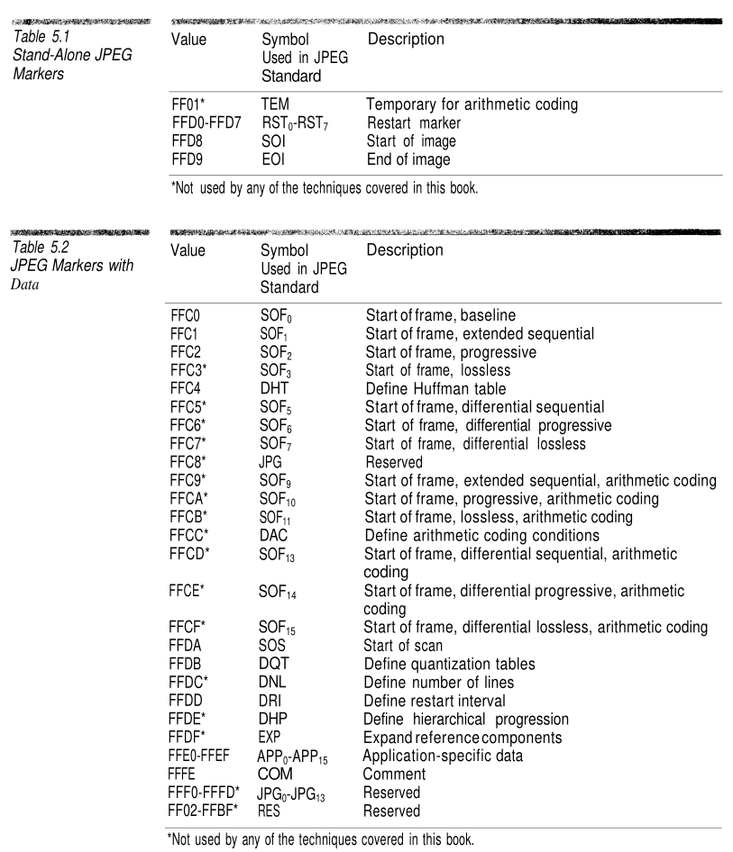
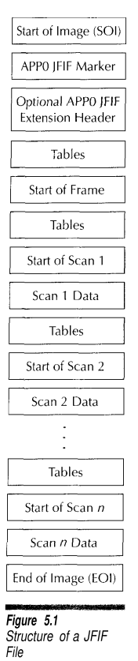
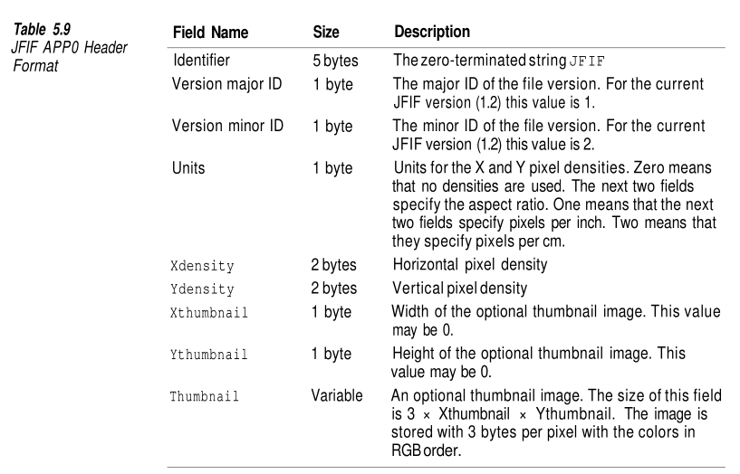
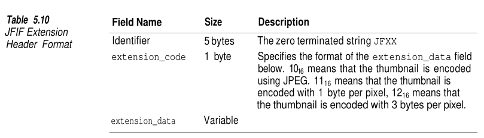
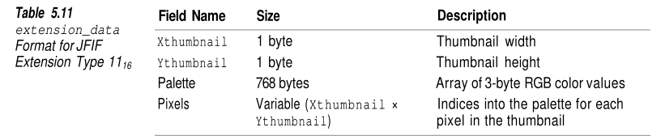
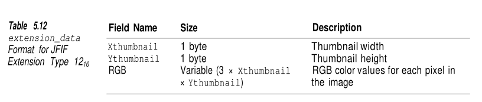

# Converting BMP files into JPEG

Project for image processing course

## The BMP format

The BMP file format is a raster graphics image file format used to store bitmap digital images independent of the display device. It is capable of storing bidimensional images in various color depths, and optionally, with data compression, alpha channel and color profile.

### BMP file structure

1. **header**: 14 bytes
- signature: 2 bytes - "BM"
- file size: 4 bytes (size of file in bytes)
- reserved: 4 bytes (when 0 -> unused)
- data offset: 4 bytes (file offset to raster data)

2. **(DIB) info header**: 12 to 124 bytes depending on the version*
- size (of info header)
- width (of image)
- height (of image)
- planes ( = 1)
- bit count (bits per pixel)
    - 1 = monochrome palette => number of colors = 1
    - 4 = 4-bit palette => number of colors = 16
    - 8 = 8-bit palette => number of colors = 256
    - 16 = 16-bit RGB => number of colors = 65536
    - 24 = 24-bit RGB => number of colors = 16M
- compression
    - 0 = BI_RGB => no compression
    - 1 = BI_RLE8 => 8-bit RLE encoding
    - 2 = BI_RLE4 => 4-bit RLE encoding
- image size
- X pixels per meter
- Y pixels per meter
- used colors
- important colors
- color table (only if bit count <= 8)
    - red
    - green
    - blue
    - reserved (0 = unused)
- ...

3. **raster data**

*) There are 7 possible versions: BITMAPCOREHEADER / OS21XBITMAPHEADER (12 bytes), OS22XBITMAPHEADER (2 types - 64 and 16 bytes), BITMAPINFOHEADER (40 bytes), BITMAPV2INFOHEADER (52 bytes), BITMAPV3INFOHEADER (56 bytes), BITMAPV4HEADER (108 bytes), BITMAPV5HEADER (124 bytes).

## The JPEG format

JPEG is an acronym that stands for Joint Photographic Experts Group and is the most used format for storing photographic images. It gives the greatest compression of any bitmap format in common use (a 1 MB .bmp can take up to 50 KB with .jpeg). Converting to JPEG is a computationally-intensive process, but its outstanding compression generally outweighs the required processing. All JPEG compression methods are lossy, meaning that the format is unsuitable for intermediate storage format or when an image is edited repeatedly. Moreover, JPEG generally performs worse at compressing text than at compressing photographs.
The original standard defines 4 compression modes:

### Intro:

A _scan_ is a block of compressed data that represents a single pass through the image for one (non-interleaved - one row at a time, top down, left right; an MCU is one data unit) or more components (interleaved - encoded as groups of data known as minimum coded units, a component's vertical sampling frequency specifies the number of data row units and its horizontal frequency gives the number of columns; components are not interleaved within an MCU). Scans are always encoded with complete MCUs. If the height or the width is not a multiple of the MCU size, padding pixels are added so that the compressed data always contains complete MCUs.

_Sampling frequency_ is the relative frequency a component is sampled at. The more frequently samples are taken, the better the approximation of the original image.

1. **sequential**

    The plain vanilla JPEG mode. Encoding is done top to bottom. It supports 8 and 12-bit precision sample data. Each color component is encoded in a single *scan*. Each pass through the image is stored in a distinct data block called *scan*, while in most of the other formats the compressed pixel data is stored in one contiguous region in the file.
   
    Two entropy encoding processes are defined: Huffman encoding and arithmetic encoding. *Most JPEGs use sequential compression with Huffman encoding and 8-bit sample data*. A particular case of the Huffman encoding process in JPEGs is the *baseline process*. Baseline images can have only 8-bit samples and are restricted to fewer Huffman and quantization tables than extended sequential images.

2. **progressive**
  
    Images are encoded in multiple scans. The compressed data for each component is placed in a minimum of 2 and as many as 896 scans (usually a number closer to the lower bound). Initial scans create a rough version of the image while subsequent scans refine it. Progressive images are intended for viewing as they are decoded. They prove useful when an image is being downloaded over a network because users get an idea of what the image contains while as little data as possible is transmitted (low cost rejection in terms of network usage).

    The main drawbacks of this compression mode is that it requires much more processing than the sequential kind. Moreover, the size of a progressive-mode image is similar to the size of a sequential-mode image. It proves useful when the transmission speed is exceeded by the processing power. All in all, it is rarely used.

3. **hierarchical**
   
    It is a super-progressive mode in which images are broken into sub-images called *frames*. If only a low resolution of an image is desired, not all of the frames are required to get the desired result. It may be a better mode than progressive when low transmission rates are used. Requires a lot of additional processing and takes up more space.
   
    A really rare sight in terms of JPEGs.

4. **lossless**
  
    The original "lossless" JPEG format. Deprecated because it was worse than other lossless formats. It has been replaced by JPEG-LS.

The JPEG standard does not define any kind of file format. This void has been filled up by Eric Hamilton's JFIF (JPEG File Interchange Format). Since it has been published JFIF has become synonymous with "JPEG File". Any .jpg or .jpeg file complies with the JFIF format. TIFF files use JPEG compression as well.    

### Details

Integers are stored in the big endian format, bit strings are stored from the most significant to the least significant

In most graphics file formats, all the color components are sampled at the same frequency. JPEG allows individual components to be sampled at different frequencies. Sampling frequencies allow images to be compressed while varying the amount of information contributed by each component.

The steps of JPEG encoding:

1. **sampling**: convert pixel data from native color space to YCbCr and perform down sampling 
2. **discrete cosine transform**: convert data units (8 x 8 pixel blocks) values into a sum of cosine functions 
3. **quantization**: remove discrete cosine transform coefficients that are not essential for recreating a close approximation of the original (here is where the lossy part is)
4. **huffman encoding**: (entropy coding) eliminate long runs of zeros

_Markers_ are used to break up a JPEG stream into its component structures. They are 2 bytes in length with the first byte always being 0xFF, the second byte specifies the type of the marker. Any number of bytes with the value FF16 may be used as a fill character before the start of any marker. A byte in a JPEG stream with a value of FF16 that is followed by another FF16 byte is always ignored. There are 2 kinds of markers. The _stand-alone_ contain no data other than the 2 bytes. _Non-stand-alone_ markers are followed by a 2-byte long value that gives the number of bytes of data the marker contains (including the 2 length bytes, but not the 2 marker bytes).

### JFIF files

For all practical purposes a JPEG file means a JPEG file in JFIF format.

## Bibliography

1. [BMP GitHub summary](https://gibberlings3.github.io/iesdp/file_formats/ie_formats/bmp.htm#RasterData)
2. [BMP Wiki](https://en.wikipedia.org/wiki/BMP_file_format#Color_table)
3. [BMP Official Windows Documentation](https://learn.microsoft.com/en-us/dotnet/desktop/winforms/advanced/types-of-bitmaps?view=netframeworkdesktop-4.8)
4. [SDL Wiki - for debugging](https://wiki.libsdl.org/SDL2/SDL_PixelFormatEnum)
5. [JPEG Official Documentation](https://jpeg.org/jpeg/)
6. [JPEG Wiki](https://en.wikipedia.org/wiki/JPEG)
7. [*Compressed Image File Formats JPEG, PNG, GIF, XBM, BMP. Your guideline to graphics files on the Web*, John Miano](./doc/book.pdf), Addison Wesley, 1999
8. [Branch Education YouTube video](https://www.youtube.com/watch?v=Kv1Hiv3ox8I&list=WL&index=16&ab_channel=BranchEducation)